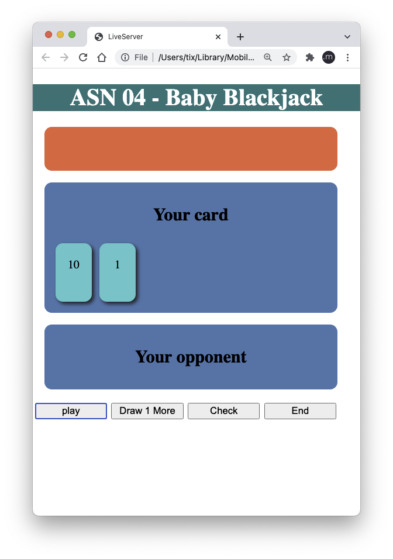
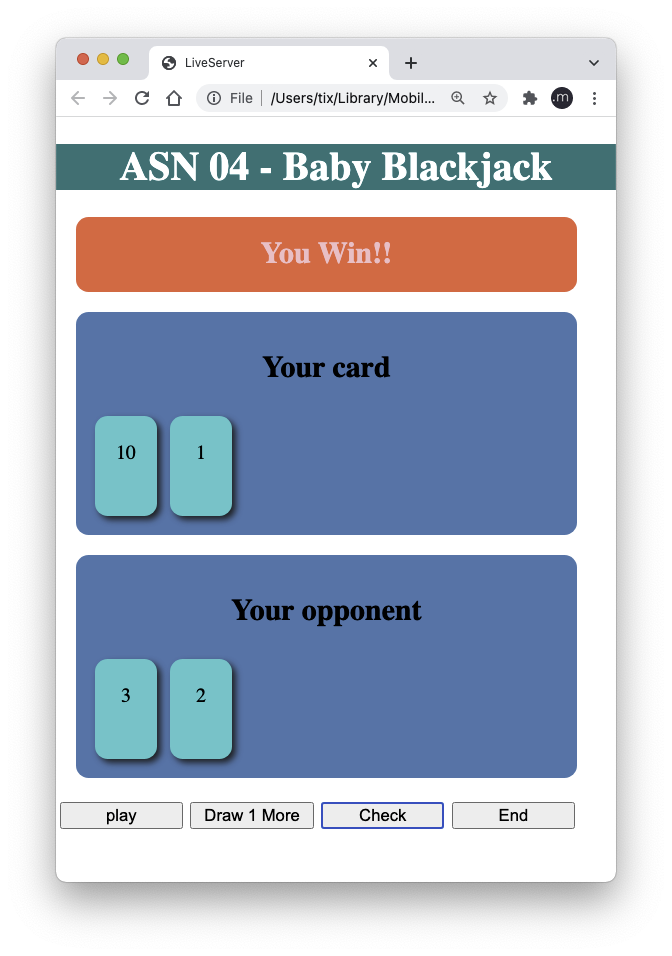
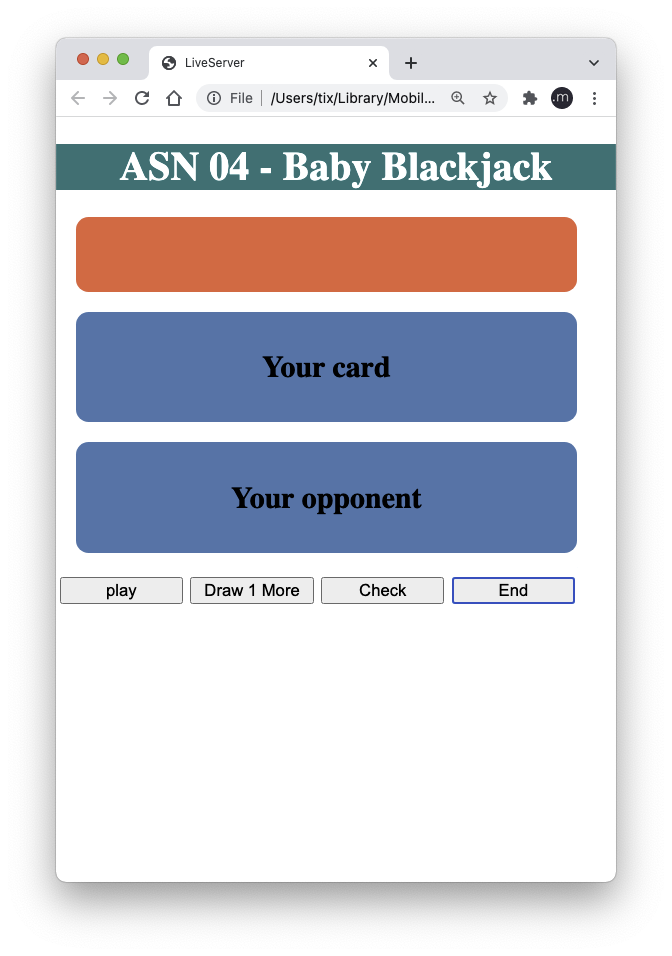
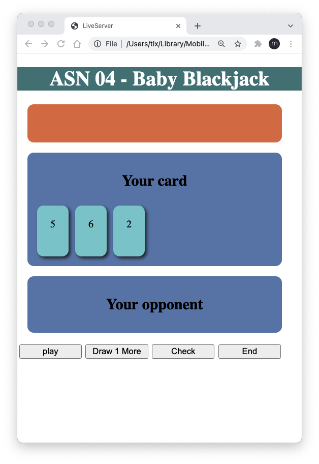

Assignment #4

Create a basic Blackjack game.

Rules:
You will draw 2 cards to begin with.
You may ask for another card.
Each card has a value (the random value from 1 to 10).

Your opponent will get exactly 2 cards.

The player's score is the sum of values from all the player's cards.
Who has the higher score wins.
If your score is more than 21, you lose.

Clicking "Play" will start fresh, getting 2 random cards (regardless of the state of the game).
Clicking "Draw 1 More" will draw the 3rd card. This is optional. The user doesn't have to draw it.
Clicking "Check" will check the result and show the result message: "You Win!!", "Draw", or "You Lose".
Clicking "End" will end the game, all cards will ge gone (regardless of the state of the game). The result message shall be cleared as well.
If the user doesn't click "Play" but clicks "Draw 1 More", assume that the user wants all 3 cards. The game shall random 3 cards to the user right away.

Initial screen:

Click "Play"

Click "Check"

Click "End"

Click "Draw 1 More"

